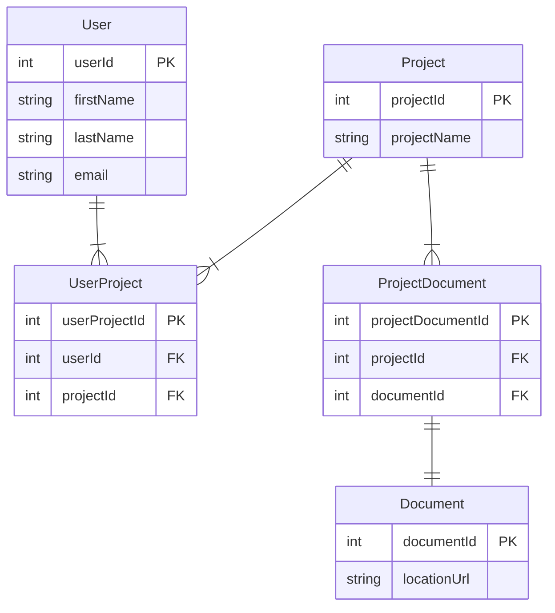

# versionLab
Version control with file upload for lab management.

## Database design

```mermaid
erDiagram

    User {
        int userId PK
        string firstName
        string lastName
        string email
    }
    
    UserProject {
        int userProjectId   PK
        int userId  FK
        int projectId   FK
    }

    Project {
        int projectId   PK
        string projectName
    }

    Document {
        int documentId  PK
        string locationUrl
    }

    ProjectDocument {
        int projectDocumentId   PK
        int projectId   FK
        int documentId  FK
    }

    User ||--|{ UserProject : ""
    Project ||--|{ UserProject : ""
    Project ||--|{ ProjectDocument : ""
    ProjectDocument ||--|| Document : ""

```
